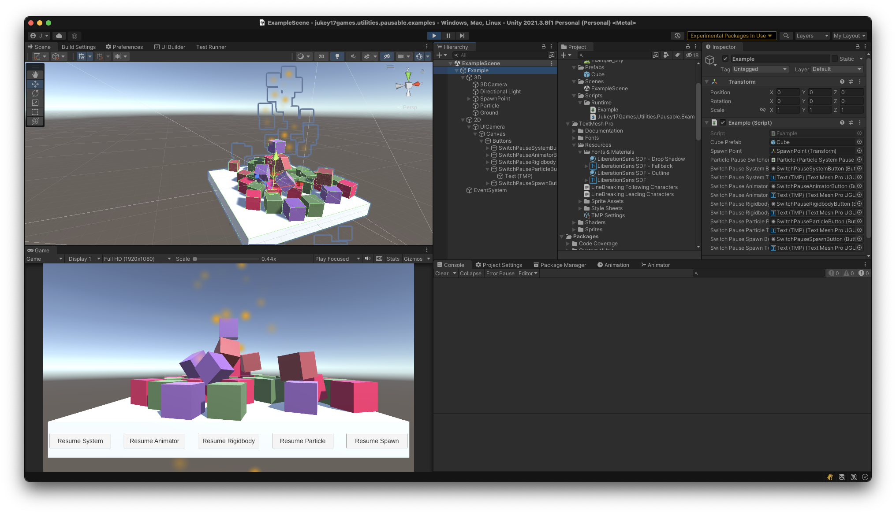

# jukey17games.utilities.pausable.examples

## 概要

[jukey17games.utilities.pausable](https://github.com/jukey17/jukey17games.utilities.pausable) の使用例を紹介するリポジトリです。

また、開発者の開発用のリポジトリも兼用しています。

## スタートガイド

### 1. リポジトリをclone

```bash
git clone https://github.com/jukey17/jukey17games.utilities.pausable.examples.git
```

### 2. submoduleの初期化
```bash
git submodule update --init --recursive
```
※clone時に `--recursive` オプションを付けてもOK

### 3. [対応するUnityのバージョン](./ProjectSettings/ProjectVersion.txt) で開く

### 4. Exampleシーンを開いて再生する


